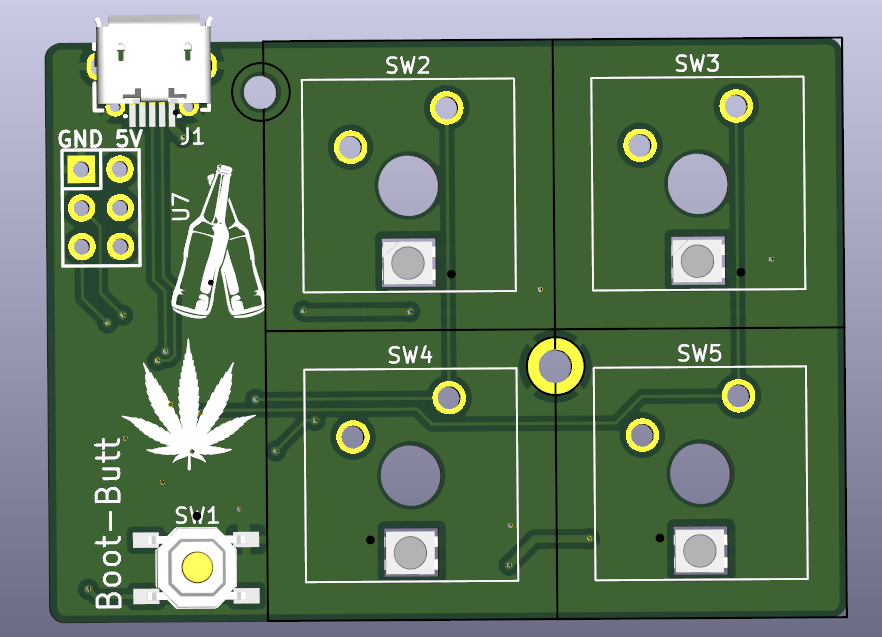

# Migouner2
Second Mechanical Keyboard. This is a follow up of a keyboard, built 6 years ago: https://github.com/migoun/mechanical_keyboard_mac

Changes:
- STM32 MCU instead of Atmel Chip
- Addressable RGB LEDs backlight for each key (therefore the STM32)
- USB Micro port, to make this as low profile as possible
- Using JLCs Assembly service for one side of the board. 6 years ago, that didn't exist - or at least not for free. So i soldered everything back then
- First tries with printed 3D casings. Eventually CNC machining at a later stage

This time i start with a dev board, instead the whole keyboard:

**Front**

**Back**
